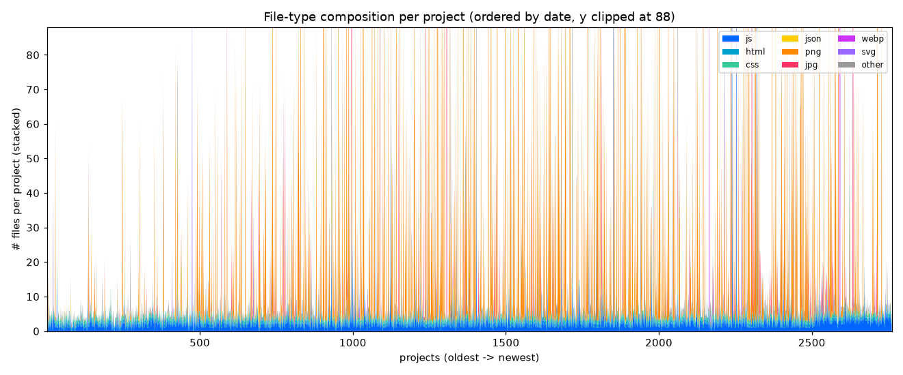
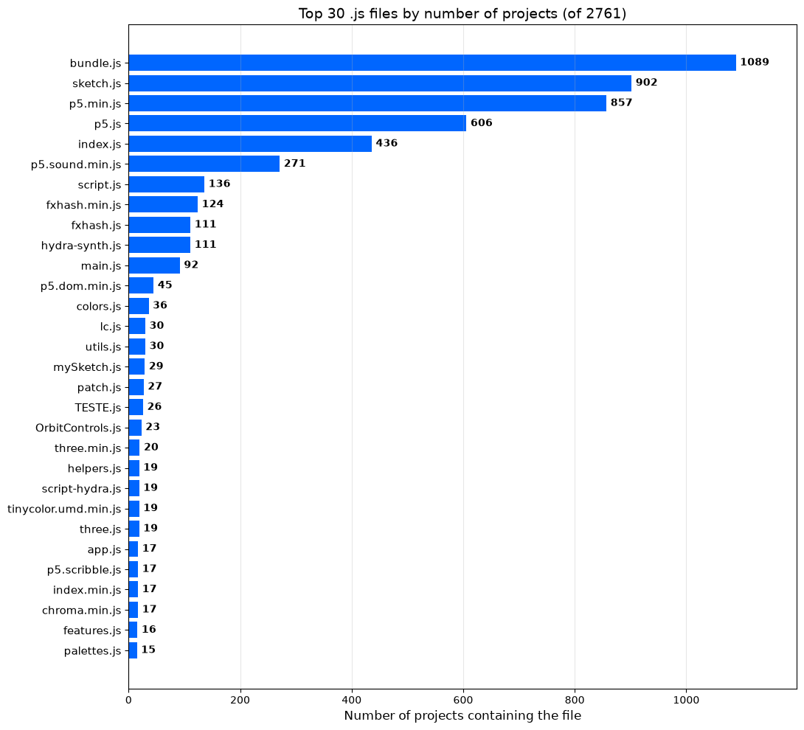

# 7. Code statistics

Statistics computed over the **2,761 downloaded projects** (the 10%-per-year
sample — see [06 — Archive coverage](06-archive-coverage.md)). MacOS junk (`__MACOSX/`, `._*`) is
excluded throughout. Two notebooks reproduce and visualise these numbers:

- **`js_libraries.ipynb`** — most common `.js` files across projects
- **`file_composition.ipynb`** — file-type composition of each project

## Files per project

| Metric | Files |
|--------|------:|
| Median | 6 |
| Mean | 21.6 |
| 90th percentile | 56 |
| 99th percentile | 208 |
| Max | 1,911 |

Most projects are small (a handful of files); a few asset-heavy projects hold
hundreds or thousands of images.

## Total files by type

Across all projects, counting every file:

| Type | Files |
|------|------:|
| `.png` | 35,523 |
| `.js` | 8,418 |
| `.jpg` | 3,026 |
| `.html` | 2,790 |
| `.css` | 2,262 |
| `.webp` | 2,053 |
| (no extension) | 1,152 |
| `.txt` | 877 |
| `.frag` | 681 |
| `.md` | 460 |
| `.svg` | 374 |
| `.json` | 347 |

Images (`.png`/`.jpg`/`.webp`) dominate by volume; `.js` is the largest *code*
type. Full per-project breakdown: `data/project_file_types.csv`.

Drawn per project (each column is one project, layers in a fixed order), the
composition looks like this — a thin baseline of code (`js`/`html`/`css`) with
frequent image spikes (`png`/`jpg`) from asset-heavy pieces:

`file_composition.ipynb` renders the same data **interactively** (zoom, hover for
the project name and counts); the standalone versions live in
`charts/file_composition_by_date.html` and `..._by_name.html`.

## Entry point: `index.html`

Every fxhash project runs from a single **`index.html`** at its root — this is
the file the platform loads to display the minted artwork. In the sample:

- **All 2,761 projects have an `index.html`** at the root (0 without one).
- **2,747** have exactly one `.html` file; **14** carry extra ones
  (`test.html`, `tester.html`, `index (copy).html`, ...).

Those extra HTML files are the artist's leftover drafts, **not** separate
artworks — the minted piece is always `index.html`. Every tool here that runs or
inspects an artwork therefore uses `index.html` as the entry point.

## Most common `.js` files

How many projects contain a file with each name (deduplicated within a project):

| `.js` file | Projects | % |
|------------|---------:|---:|
| `bundle.js` | 1,089 | 39.4% |
| `sketch.js` | 902 | 32.7% |
| `p5.min.js` | 857 | 31.0% |
| `p5.js` | 606 | 21.9% |
| `index.js` | 436 | 15.8% |
| `p5.sound.min.js` | 271 | 9.8% |
| `script.js` | 136 | 4.9% |
| `fxhash.min.js` | 124 | 4.5% |
| `fxhash.js` | 111 | 4.0% |
| `hydra-synth.js` | 111 | 4.0% |
| `main.js` | 92 | 3.3% |

There are **1,948 distinct `.js` file names** in total; 1,321 of them appear in
only one project (custom per-artist names). The **p5.js** library (in its several
variants) is by far the most reused dependency; **three.js**, **hydra-synth**,
**tone.js** and others form a much smaller long tail. Full ranking:
`data/js_file_counts.csv`.

Licenses are covered separately in [08 — Licenses](08-licenses.md).

Back to the [documentation index](README.md).
