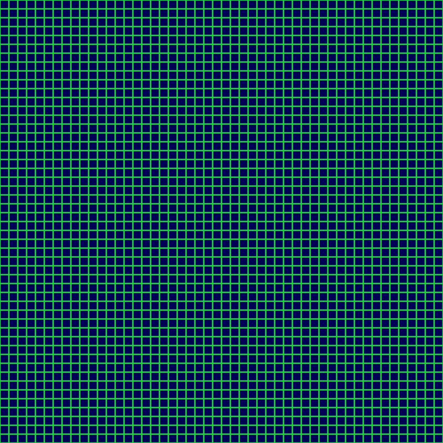

# 9. Executing the artworks

fxhash artworks are **programs, not pictures** — the image only exists while the
code runs in a browser. So a natural question for a preservation archive is:
**do the downloaded artworks still execute?** This page describes the tool that
answers it, `run_artworks.py`.

## Why this matters

A JPEG always opens. A generative artwork is alive only as long as its code can
run: if a dependency disappears, an external CDN dies, or an IPFS folder is
unpinned, the piece effectively stops existing even though the files remain.
Measuring "can it execute?" turns the archive into data about the **longevity of
on-chain generative art**.

## How it works

`run_artworks.py` runs each artwork in a **headless Chromium** browser
(via Playwright) and decides whether something rendered.

1. **Local server.** The `projects/` folder is served over a local HTTP server so
   relative assets resolve correctly (opening via `file://` breaks many pieces).
2. **Entry point.** Each artwork is loaded from its **`index.html`** — the file
   fxhash uses to display the minted piece (see
   [07 — Entry point](07-code-statistics.md)).
3. **fxhash context.** The URL carries the parameters the snippet expects —
   `?fxhash=…&fxiteration=1&fxminter=…&fxchain=…` — and a stub `fxpreview()` is
   injected so pieces that call it don't crash (and so we can detect the call).
4. **Offline by design.** Every request to a non-`localhost` host is **blocked**
   and recorded. A piece that only works with an external resource therefore
   fails here — and is labelled accordingly rather than called "broken".
5. **Detection.** After a short render wait, the harness combines several runtime
   signals (below) into a verdict, and saves a screenshot only for the pieces
   that did **not** execute.

Example of a piece that executes offline (`RGB Grid Experiment`, 2021), captured
by the harness:



## Verdicts

| Verdict | Meaning |
|---------|---------|
| `executes` | the artwork rendered / is running |
| `external-dependency` | it failed because a blocked external resource (CDN, `ipfs://`) was required |
| `broken` | the code threw an error, or nothing rendered |
| `no-html` | the folder has no `index.html` to run |
| `needs-params` | an fxhash 2.0 piece that needs `fxparams` to run |

## Detection signals

A piece counts as `executes` on any of these, provided there is no fatal error:

- **`canvas`** — the screenshot is non-blank. "Non-blank" is measured by the
  **number of distinct colours** (robust to fine or progressive graphics; a plain
  colour-count avoids the false negatives a grayscale/variance test produces).
- **`fxpreview`** — the artwork called `fxpreview()`, its own "first frame done"
  signal.
- **`canvas-js`** — reading the canvas pixels directly in the page shows content
  (used when a screenshot can't be taken).
- **`heavy`** — the page is so busy rendering that a screenshot times out, yet it
  threw no error: a continuously drawing piece is executing.

`blocked` marks the external-dependency case; the CSV records the blocked hosts.

## How to run

The runner is **resumable and works in chunks**: results accumulate in the CSV and
already-checked projects are skipped, so a large archive can be run a bit at a time.

```bash
python run_artworks.py              # check every project not yet done
python run_artworks.py 100          # check the next 100 (a chunk)
python run_artworks.py --headed 20  # same, but show the browser window
python run_artworks.py --fresh      # start over (clear previous results)
```

Two interactive modes let you inspect by hand:

```bash
python run_artworks.py --browse       # one window with the project list; click what to run
python run_artworks.py --open "Sea"   # open one project (by name) in a visible window
```

For the full clickable UI see [the Playwright UI runner](#the-playwright-ui-runner)
below.

Results are written incrementally to **`data/execution_results.csv`**:

| column | meaning |
|--------|---------|
| `relpath, name, version, year` | which project |
| `verdict` | executes / broken / external-dependency / no-html / needs-params |
| `reason` | for failures, a clear "why" (see below) |
| `kind` | for pieces that run: `still-image` or `moving-image` |
| `interactive` | `yes`/`no` — reacts to mouse / touch / keyboard |
| `sound` | `yes`/`no` — uses audio |
| `nb_files, size` | file count and total bytes of the project folder on disk |
| `signal, blocked_hosts, error` | the raw detection detail |

Failure screenshots go to **`charts/execution_fails/`**. The runner is **offline**
— it blocks all non-local requests — and the `fxhash` seed is fixed, so re-runs are
reproducible (only `heavy` pieces can vary with machine load). While running it
logs progress per project — position, %, running tally, elapsed time and ETA.

### The JSON report

At the end of every run the runner also rebuilds **`data/results.json`** — one
merged record per project, combining the execution result with the on-disk stats
and the API metadata:

```json
{
  "name": "fxhash-1.0-tezos/2021/(open_) Sea__5097",
  "date": "2021-12-27T22:31:30+00:00",
  "nb_files": 5,
  "nb_mints": 11,
  "size": 4257953,
  "execute": true,
  "type": ["moving-image", "interactive"],
  "error": [],
  "log": ""
}
```

`type` is empty when the piece fails, otherwise it lists `still-image` /
`moving-image` plus `interactive` and `sound` when present; `error` holds the
failure reason(s) and `log` the raw browser log. `date` and `nb_mints` come from
`data/project_metadata.csv` (run `collect_metadata.py` first to populate them).
Because it is rebuilt from the resumable CSV, a chunked run's `results.json`
always reflects everything checked so far.

## Why a piece failed (the `reason` column)

When a piece does not run, `reason` says why, in plain words:

| reason | meaning |
|--------|---------|
| `file is missing (no index.html)` | the folder has no entry point to run |
| `missing resource: <error>` | a file the piece needs returned 404 (not in the download) |
| `api/resource unaccessible: needs <hosts>` | it required a blocked external resource |
| `browser incompatible: <error>` | it needs a browser feature that isn't available (WebGL / WebGPU / …) |
| `runtime error: <error>` | the code threw an error (the error text is the log) |
| `blank screen: nothing rendered, no error` | nothing drew, and nothing errored |

**Analytics don't count.** Requests to trackers, analytics, and font CDNs
(Google Tag Manager, Google Analytics, `gstatic`, `fonts.googleapis`, …) are
blocked like any other external host, but they are **ignored** when deciding the
reason: a piece that renders fine while merely pinging Google Analytics is
`executes`, not `external-dependency`.

## What kind of piece (for the ones that run)

For every artwork that executes, the runner also records **what it is**, by
watching it for a couple of seconds and poking it:

- **still-image vs moving-image** — two frames ~1.2 s apart are compared; if they
  differ, the piece animates.
- **interactive** — the piece registered mouse / touch / keyboard listeners, or a
  still frame changed after the runner moved the mouse and clicked.
- **sound** — the piece created an `AudioContext`, called `.play()`, or has an
  `<audio>` / `<video>` element.

These are heuristics: audio usually needs a user gesture to actually start, so
`sound` means "audio is present", not "audio was heard".

## The Playwright UI runner

For hands-on inspection there is a second runner built on the **Node.js Playwright
test UI**. It lists every project as a test; you click one to run it in an embedded
browser and see the full **Log / Console / Network / Errors** panels. A green test
rendered; a red test shows the failure reason.

```bash
npm install                      # first time only (installs @playwright/test)
npx playwright install chromium  # first time only (downloads the browser)
npm run ui                       # open the UI
```

Filter the list with environment variables when it is large:

```bash
FX_FILTER=pipes npm run ui   # only projects whose path contains "pipes"
FX_LIMIT=200 npm run ui      # only the first 200
```

Click a test to run it. A **green** test rendered; a **red** one did not, and its
error message is the failure reason. The **conclusion** — for a green test what it
is (`still-image` / `moving-image`, `interactive`, `sound`), for a red one why it
failed — is shown in three places: the **Annotations** tab, a labelled step in the
**Actions** list, and the page **Console** tab (`[fxhash] executes — …`).

### Viewing one artwork yourself (step by step)

You can open any downloaded artwork in a normal browser and watch it run — fully
**offline**, no internet needed. Double-clicking `index.html` will **not** work:
a browser refuses to let a `file://` page load its neighbouring files
(`bundle.js`, images, …), so the piece stays blank. The fix is a tiny **local
server** that hands the folder to the browser. It does not touch the internet —
everything stays on your machine.

**1. Open a terminal.** On Windows: press the **Windows** key, type `powershell`,
and press **Enter**.

**2. Go to the project folder:**

```bash
cd D:\KPI\canada\intership
```

**3. Start the local server** (serves the `projects/` folder):

```bash
python -m http.server 8000 --directory projects
```

When you see `Serving HTTP on ... port 8000`, it is running. **Leave this window
open** — the server lives only as long as the window is open. (If `python` is not
found, try `py -m http.server 8000 --directory projects`.)

**4. Open the listing in a browser** (Chrome, Edge, …):

```
http://localhost:8000/
```

Then just **click through the folders** — `fxhash-1.0-tezos/` → a year → an
artwork folder → `index.html` — and the piece renders. No path typing needed.

**5. If a piece looks blank,** add an fxhash seed to the end of its address and
press Enter:

```
http://localhost:8000/fxhash-1.0-tezos/2021/Charcoal%20Landscapes__148/index.html?fxhash=ooTest123&fxiteration=1
```

The artwork reads `fxhash` from the URL as its random seed (spaces in a folder
name become `%20`). A different value gives a different image — this is the same
seed the automated runner injects.

**6. Stop the server** when you are done: click the terminal window and press
**Ctrl + C** (or just close it).

**Troubleshooting**

| Message | Fix |
|---------|-----|
| `python is not recognized` | Use `py` instead of `python`. |
| `No such file or directory: projects` | You are in the wrong folder — redo step 2, then check `projects/` exists with `dir`. |
| `http://localhost:8000/` won't open | The server isn't running (window closed) — redo step 3. |

## Prototype results (50-project sample)

Calibrated on a representative sample of 50 projects:

| Verdict | Count |
|---------|------:|
| executes | 49 |
| external-dependency | 1 |
| broken | 0 |

Calibration removed two classes of false negative: fine/progressive graphics
mis-read as "blank" (fixed with the colour-count test and a longer render wait),
and heavy animations whose screenshot timed out (fixed with the canvas-pixel and
`heavy` fallbacks).

## Caveats

- **"Executes" is a heuristic** — it means "something rendered without a fatal
  error", not that the output is pixel-identical to the original mint.
- **`heavy`** pieces are inferred to run from the absence of errors; a rare piece
  stuck in a silent infinite loop would also land here.
- **fxhash 2.0 param-based** pieces may need real `fxparams`; without them they
  can under-render and are flagged `needs-params`.
- **Offline** means external-dependency pieces are counted separately, not as
  failures of the art itself.

## Status

The runner is resumable and records, per project, the verdict, the failure
`reason`, and — for pieces that run — whether they are still/moving, interactive,
and have sound. The full run over the whole archive (on DIRO) is done in chunks.

Back to the [documentation index](README.md).
