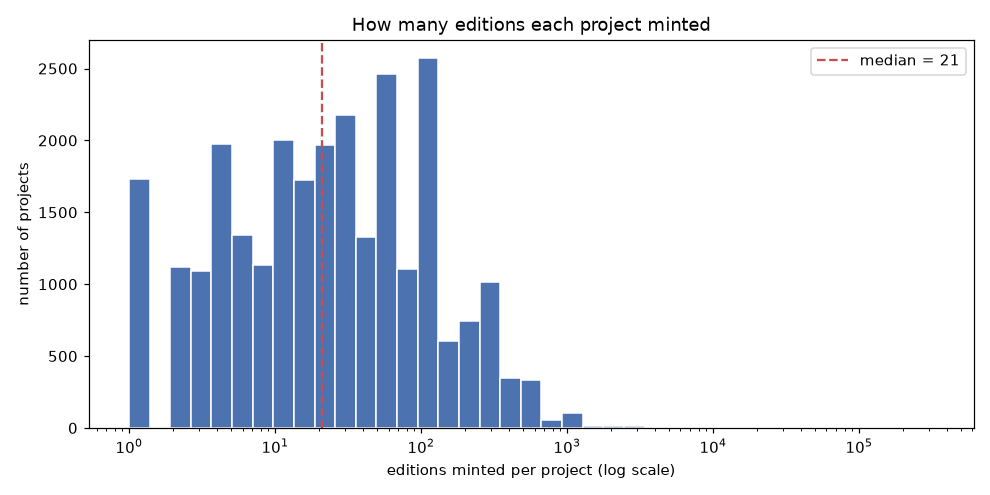
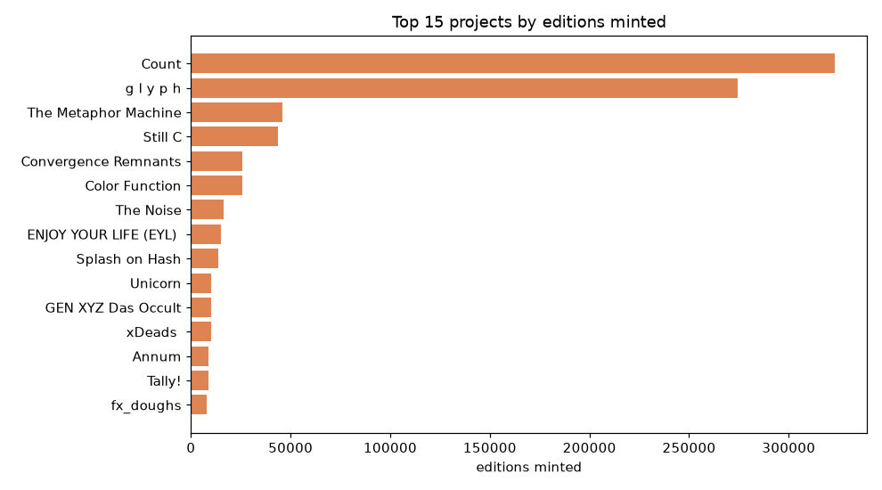
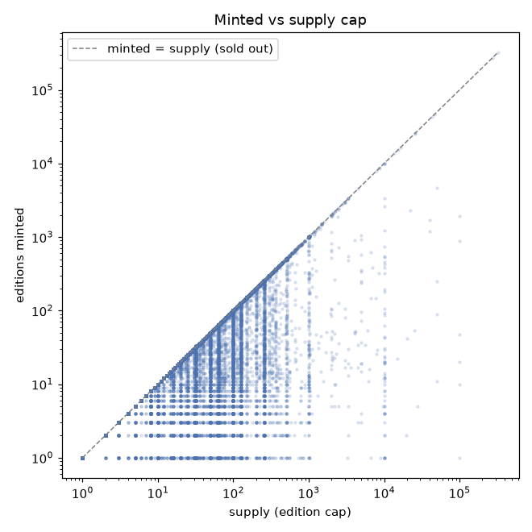
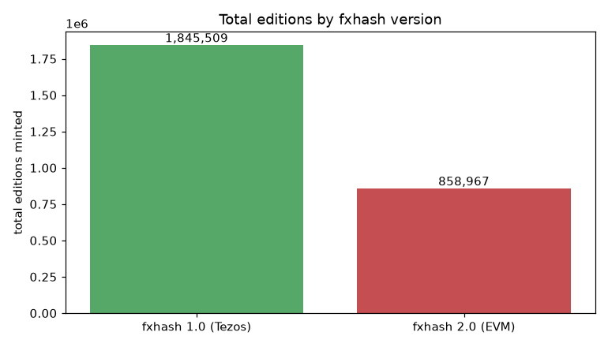

# 10. Editions per project

This page answers **how many artworks (editions) were minted per project** — the
difference between "how many programs artists released" and "how many actual
pieces exist". All numbers come from `data/fxhash_tokens.csv`; the charts are
produced by `editions.ipynb`.

## Project vs edition

fxhash has two levels (see [01 — Overview](01-overview.md)):

- a **project** is one generative *program* (one row in the dataset);
- an **edition** (*iteration* / *gentk*) is one *minted output* of that program —
  a unique NFT.

Two columns describe minting:

- **`supply`** — the edition cap the artist set (how many *can* be minted);
- **`iterations_count`** — how many were *actually* minted.

## Headline numbers

| Metric | Value |
|--------|------:|
| Projects (with a mint count) | 28,124 |
| **Total editions minted** | **2,704,476** |
| Median editions per project | 21 |
| Mean editions per project | 96.2 |
| Max (single project) | 323,264 |
| Projects never minted (0 editions) | 1,124 |
| Projects that sold out | 19,561 of 27,798 (70%) |

So **~28k programs produced ~2.7 million individual artworks**. This is the
**leverage of preservation**: saving one project's code preserves the program
behind *all* of its editions. The 27,596 salvaged projects
(see [06 — Archive coverage](06-archive-coverage.md)) therefore hold the code
behind the overwhelming majority of those 2.7M pieces.

## Distribution — editions per project

Most projects are small and a few are enormous, so the x-axis is logarithmic.



The distribution is heavily **right-skewed**: the median project minted just **21**
editions, yet the mean is **96** — dragged up by a long tail of blockbusters. Over
a thousand projects were never minted at all.

## Top projects — a few blockbusters dominate



The concentration is extreme: the **top 1% of projects (281) hold 42% of all
editions**. Nine of the ten biggest are fxhash 2.0 (EVM) projects, led by **Count
(323,264)** and **g l y p h (274,464)** — two projects alone account for roughly
600k editions.

## Sell-through — minted vs supply cap



Comparing what was minted against the `supply` cap shows demand: points on the
diagonal sold out, points below it left edition slots unsold. **70% of projects
with a cap sold out**, but the median project minted only 21 of a median cap of 44
— many editions were minted well short of their limit.

## By platform version



| Version | Projects | Total editions | Median per project |
|---------|---------:|---------------:|-------------------:|
| fxhash 1.0 (Tezos) | 27,430 | 1,845,509 | 21 |
| fxhash 2.0 (EVM) | 694 | 858,967 | 13 |

The striking part: fxhash 2.0 has only **694 projects but 858,967 editions — about
a third of all editions ever minted** — almost entirely because of its two mega
projects. Per project the EVM median (13) is actually *lower* than Tezos (21); the
platform total is carried by a handful of outliers, not by broad activity.

## Reproduce

```bash
jupyter notebook editions.ipynb
```

Run all cells; the four charts are saved to `docs/img/editions_*.png` and the
headline numbers are printed inline.

Back to the [documentation index](README.md).
