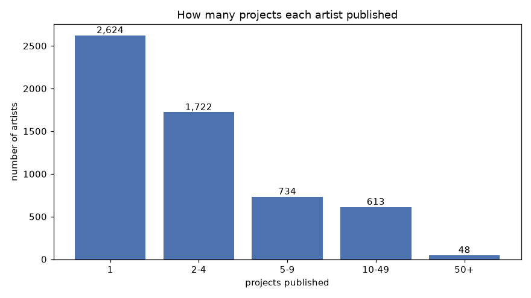
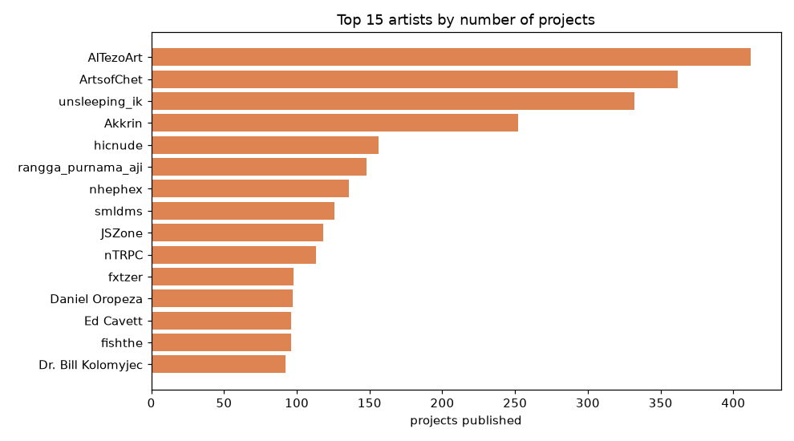
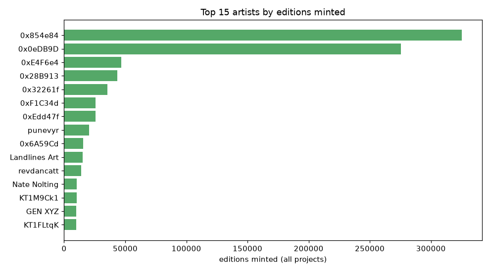

# 11. Artists

How many different artists published on fxhash, and how unevenly the work is
spread across them. Numbers come from `data/fxhash_tokens.csv`; charts are
produced by `artists.ipynb`.

## Who counts as an artist

Identity is the **wallet address** (`author_id`); `author_name` is the display
name. The wallet is the reliable key, but it has one caveat: the same person can
use more than one wallet, and Tezos wallets (`tz…`) and EVM wallets (`0x…`) are
always different — so an artist active on **both** platform versions is counted
twice. The true number of *people* is therefore a little lower than the wallet
count.

## Headline numbers

| Metric | Value |
|--------|------:|
| Distinct artists (wallets) | 5,741 |
| Distinct display names | 4,593 |
| Artists on fxhash 1.0 (Tezos) | 5,407 |
| Artists on fxhash 2.0 (EVM) | 334 |
| Median projects per artist | 2 |
| Mean projects per artist | 4.9 |
| Most by one artist | 412 |

So roughly **5,700 wallets (~4,600 unique names)** released the 28,194 projects.
Because wallets don't cross chains, the Tezos and EVM artist sets don't overlap
in the data (5,407 + 334 = 5,741).

## How many projects each artist published



The distribution is very uneven. **2,624 artists (46%) published a single
project**, and another 1,722 published between two and four. Only **48 artists
released 50 or more**. The top 1% of artists (57 wallets) account for **18% of all
projects** — a small core of prolific creators sits on top of a very long tail of
one-off releases.

## Most prolific artists (by number of projects)



The busiest accounts — **AITezoArt (412)**, **ArtsofChet (362)**,
**unsleeping_ik (332)** — are all on Tezos, where the 2021–22 boom rewarded high
output.

## Most collected artists (by editions minted)



Ranking by *editions minted* instead of project count tells a different story: the
top is dominated by a few **fxhash 2.0 (EVM)** wallets whose one or two mega
projects were minted hundreds of thousands of times (see
[10 — Editions](10-editions.md)). Prolific output and mass collection are largely
**two different groups** of artists.

## Reproduce

```bash
jupyter notebook artists.ipynb
```

Run all cells; the three charts are saved to `docs/img/artists_*.png` and the
headline numbers are printed inline.

Back to the [documentation index](README.md).
